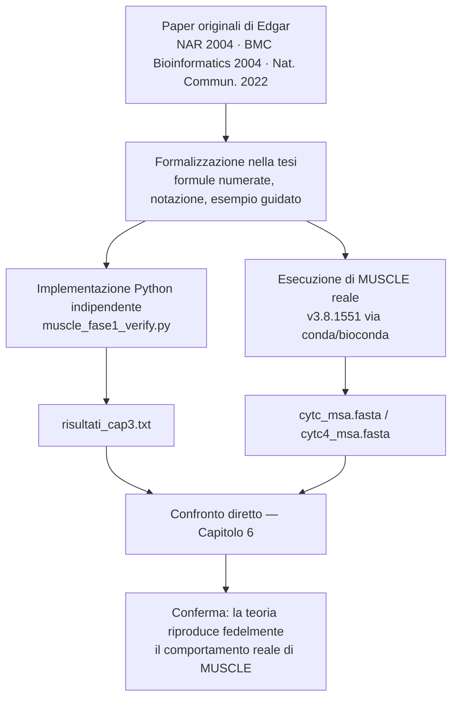

# Evoluzione Algoritmica di MUSCLE

### Dall'approccio iterativo classico ai modelli Ensemble di quinta generazione

Progetto di Bioinformatica — Corso di Laurea Magistrale in Informatica
**Università degli Studi di Salerno**, Dipartimento di Informatica — A.A. 2025/2026

`Python 3` · `Biopython` · `MUSCLE v3.8.1551` · `UPGMA` · `Needleman-Wunsch` · `BLOSUM62`

---

## Indice

1. [Il progetto in breve](#il-progetto-in-breve)
2. [Struttura della repository](#struttura-della-repository)
3. [Metodologia](#metodologia)
4. [Focus 1 — Capitolo 3, Fase 1: Draft Progressive Alignment](#focus-1--capitolo-3-fase-1-draft-progressive-alignment)
5. [Focus 2 — Capitolo 6: validazione contro MUSCLE 3.8 reale](#focus-2--capitolo-6-validazione-contro-muscle-38-reale)
6. [Come riprodurre i risultati](#come-riprodurre-i-risultati)
7. [Stato di avanzamento e roadmap](#stato-di-avanzamento-e-roadmap)
8. [Riferimenti bibliografici essenziali](#riferimenti-bibliografici-essenziali)
9. [Autori](#autori)

---

## Il progetto in breve

Questa repository accompagna il progetto *"Evoluzione Algoritmica di MUSCLE"*, che ricostruisce
— a partire dai paper scientifici originali di Robert C. Edgar — il funzionamento interno
dell'algoritmo **MUSCLE**, dalla storica architettura a tre fasi della v3 (draft progressive
alignment → improved progressive alignment → refinement iterativo) fino alla riprogettazione
probabilistica di **MUSCLE5** e alle sue estensioni **Super5** e **MUSCLE-3D**.

Il documento completo (`tesi/Tesi-BioInformatica-MUSCLE.pdf`) analizza ogni fase teoricamente;
questa repository ne contiene il **riscontro pratico**: per le fasi coperte, ogni formula citata
nel testo è stata reimplementata in Python in modo indipendente dal codice sorgente di MUSCLE,
e ogni valore numerico riportato nella tesi è stato ricalcolato da zero e poi confrontato con
l'output del software reale (MUSCLE v3.8.1551). L'obiettivo non è dimostrare che "MUSCLE
funziona" — non è mai stato in discussione — ma verificare che **la comprensione dell'algoritmo
costruita in questo progetto corrisponda a ciò che l'algoritmo realmente fa**.

## Struttura della repository

```
Tesi-MUSCLE-Bioinformatica/
├── README.md
├── requirements.txt
├── tesi/
│   └── Tesi-BioInformatica-MUSCLE.pdf        # documento completo (10 capitoli + bibliografia)
│
├── cap03_fase1_draft-progressive/            # ── FOCUS 1 ──────────────────────
│   ├── muscle_fase1_verify.py                # verifica indipendente in Python
│   ├── risultati_cap3.txt                    # output dello script (ogni numero del Cap. 3)
│   └── spiegazione_codice.txt                # guida passo-passo al codice, per la discussione
│
└── cap06_validazione_muscle3.8/              # ── FOCUS 2 ──────────────────────
    ├── cytc.fasta                            # input: 3 sequenze (Umano, Cavallo, Lievito)
    ├── cytc_msa.fasta                        # output MUSCLE reale, parametri di default
    ├── cytc_msa1.fasta                       # output MUSCLE reale, -maxiters 1 (sola Fase 1)
    ├── cytc4.fasta                           # input: dataset esteso a 4 sequenze (+Scimpanzé)
    └── cytc4_msa.fasta                       # output MUSCLE reale sul dataset a 4 sequenze
```

Ogni sottocartella corrisponde a un capitolo della tesi e ne riprende il numero nel nome, in
modo che il capitolo del PDF e il codice che lo verifica siano sempre facilmente associabili
durante la lettura o la discussione. La sezione [Roadmap](#stato-di-avanzamento-e-roadmap) qui
sotto mostra come questa stessa struttura sia pensata per accogliere i restanti capitoli.

## Metodologia

L'intero progetto — non solo i due capitoli con codice qui sotto approfonditi — segue lo stesso
percorso in quattro passaggi, dalla fonte primaria alla verifica incrociata:



In pratica, per ogni fase implementata: **(1)** la formula viene estratta e citata dal paper
originale; **(2)** viene applicata a mano a un dataset reale di citocromo c (Umano, Cavallo,
Lievito — poi esteso allo Scimpanzé); **(3)** un codice Python indipendente ricalcola lo stesso
valore senza fare riferimento al codice sorgente di MUSCLE, a riprova che il calcolo a mano è
riproducibile e non un artefatto; **(4)** dove possibile, lo stesso input viene dato in pasto al
binario reale di MUSCLE, e i due output vengono confrontati colonna per colonna.

## Focus 1 — Capitolo 3, Fase 1: Draft Progressive Alignment

Il Capitolo 3 copre la prima delle tre fasi storiche di MUSCLE: stima delle distanze tramite
k-mer counting, costruzione dell'albero guida con UPGMA, allineamento progressivo profilo-profilo
e la funzione di punteggio **Log-Expectation** che dà il nome al software. Ogni passaggio è
verificato da `muscle_fase1_verify.py` sulle stesse tre sequenze reali usate nella tesi
(UniProt P99999, forma matura di *Equus caballus*, UniProt P00044).

| Formula / passaggio nella tesi | Cosa verifica lo script | Dove, nel codice |
|---|---|---|
| Eq. 3.1 — distanza k-mer, incl. l'estratto a mano a 12 residui (§3.1.3) | Ricalcola i k-mer condivisi e la distanza, sull'estratto e sulle sequenze complete | `kmer_set()`, `kmer_distance()` |
| UPGMA — costruzione di TREE1 (§3.2) | Individua la coppia più vicina, calcola le altezze di fusione, genera l'albero in formato Newick | blocco "3. CLUSTERING UPGMA" |
| Allineamento progressivo profilo-profilo (§3.3), incl. la semplificazione "a sequenza rappresentativa" | Riproduce i due passi (Umano×Cavallo, poi profilo×Lievito) con Needleman-Wunsch + BLOSUM62 e ricostruisce l'MSA1 a 3 righe | blocco 4, `Bio.Align.PairwiseAligner` |
| Log-Expectation — esempio numerico (§3.4.2) | Estrae dal vero MSA1 i residui delle colonne 7 e 17 usate nel calcolo a mano, garantendo che i valori discussi in tesi corrispondano esattamente all'allineamento reale | blocco "6. COLONNE USATE..." |
| Identità percentuale di controllo | Ricalcola le identità a coppie come controllo incrociato indipendente | blocco 5 |

> **Nota.** Il punteggio Needleman-Wunsch + BLOSUM62 usato dallo script è la stessa
> semplificazione didattica dichiarata nel Cap. 3 (§3.3, nota metodologica): rende il calcolo
> trattabile a mano, ma non è la funzione Log-Expectation reale di MUSCLE, che valuta profili
> interi anziché una singola sequenza rappresentativa. È esattamente questa differenza a
> spiegare uno dei due scostamenti osservati nel Capitolo 6 (si veda sotto).

**Risultati principali** (riprodotti in `risultati_cap3.txt`):

| Quantità | Valore |
|---|---|
| D(Umano, Cavallo) | 0.2828 |
| D(Umano, Lievito) | 0.6800 |
| D(Cavallo, Lievito) | 0.6869 |
| Albero guida (Newick) | `((Umano:0.1414, Cavallo:0.1414):0.2003, Lievito:0.3417);` |
| MSA1 — lunghezza | 110 colonne |
| Identità Umano–Cavallo | 87.6% (92/105) |
| Identità Umano–Lievito | 60.6% (66/109) |
| Identità Cavallo–Lievito | 59.6% (65/109) |
| Colonna 7 (Log-Expectation) | G / G / G — conservata |
| Colonna 17 (Log-Expectation) | I / V / K — divergente |

## Focus 2 — Capitolo 6: validazione contro MUSCLE 3.8 reale

Il Capitolo 6 risponde alla domanda lasciata aperta dal Cap. 3: *la semplificazione didattica
adottata in questo progetto produce davvero lo stesso risultato dell'implementazione reale di
MUSCLE?* La verifica usa MUSCLE **v3.8.1551** (ramo "v3 legacy", installato via
`conda`/`bioconda` per compatibilità nativa con architettura ARM64 su Apple Silicon).

```bash
muscle -in cytc.fasta -out cytc_msa.fasta              # pipeline completa (default)
muscle -in cytc.fasta -out cytc_msa1.fasta -maxiters 1  # isola la sola Fase 1
muscle -in cytc4.fasta -out cytc4_msa.fasta             # dataset esteso, +Scimpanzé
```

| File generato | Cosa contiene |
|---|---|
| `cytc_msa.fasta` | Output reale con parametri di default (Fase 1 + 2 + 3, fino a convergenza) |
| `cytc_msa1.fasta` | Output reale limitato alla sola Fase 1 — **identico byte per byte** a `cytc_msa.fasta` |
| `cytc4_msa.fasta` | Output reale sul dataset a 4 sequenze (aggiunto lo Scimpanzé, *Pan troglodytes*) |

**Confronto MSA1 (calcolato a mano, Cap. 3) vs. MUSCLE reale (§6.3):** su 110 colonne, le
uniche discrepanze sono due, entrambe spiegate e non sintomo di errore concettuale:

- **Regione N-terminale** — dovuta esattamente alla semplificazione "a sequenza rappresentativa"
  dichiarata nel Cap. 3: MUSCLE reale valuta l'intero profilo {Umano, Cavallo} tramite
  Log-Expectation, MSA1 lo riduce alla sola sequenza Cavallo.
- **Ultima colonna** — un caso di *gap placement ambiguity* in una regione a basso segnale;
  confermato presente già nella Fase 1 pura di MUSCLE (confronto `-maxiters 1` vs. default,
  identici byte per byte), quindi non introdotto dal raffinamento successivo.

Nel mezzo, **99 colonne consecutive identiche**. Di conseguenza le colonne usate nell'esempio
Log-Expectation (§3.4.2) sono le 7 e 17 in MSA1, ma le 6 e 16 nell'allineamento reale — stessi
residui, indice numerico spostato di uno per via del disaccordo N-terminale.

**Il caso limite dello Scimpanzé (§6.4):** aggiungendo *Pan troglodytes* (citocromo c identico
all'uomo, 0 sostituzioni secondo Fitch & Margoliash, 1967) la distanza k-mer Umano–Scimpanzé
risulta **0.0000** come atteso, e le righe di Umano, Cavallo e Lievito nel nuovo allineamento a 4
sequenze restano identiche, byte per byte, a quelle ottenute con sole 3 — conferma empirica
diretta del principio di riutilizzo dei profili discusso astrattamente nel Cap. 4 (§4.4).

## Come riprodurre i risultati

```bash
# 1. Clona la repository
git clone https://github.com/gerryos95/Tesi-MUSCLE-Bioinformatica.git
cd Tesi-MUSCLE-Bioinformatica

# 2. Installa le dipendenze
pip install -r requirements.txt --break-system-packages   # oppure: pip install biopython

# 3. Rigenera i numeri del Capitolo 3
cd cap03_fase1_draft-progressive
python muscle_fase1_verify.py > risultati_cap3.txt

# 4. (Opzionale) Rigenera la validazione del Capitolo 6 con MUSCLE reale
conda create -n muscle_env -c bioconda muscle=3.8.1551
conda activate muscle_env
cd ../cap06_validazione_muscle3.8
muscle -in cytc.fasta -out cytc_msa.fasta
muscle -in cytc.fasta -out cytc_msa1.fasta -maxiters 1
muscle -in cytc4.fasta -out cytc4_msa.fasta
```

Una spiegazione blocco-per-blocco del codice — pensata per rispondere a domande del tipo *"come
hai implementato la verifica dell'algoritmo?"* in sede di discussione — è disponibile in
[`cap03_fase1_draft-progressive/spiegazione_codice.txt`](cap03_fase1_draft-progressive/spiegazione_codice.txt).

## Riferimenti bibliografici essenziali

L'elenco completo (31 voci) è nella bibliografia della tesi; questi sono i riferimenti diretti
al codice e ai confronti presenti in questa repository:

- R. C. Edgar, *MUSCLE: multiple sequence alignment with high accuracy and high throughput*,
  Nucleic Acids Research, 32(5):1792–1797, 2004.
- R. C. Edgar, *MUSCLE: a multiple sequence alignment method with reduced time and space
  complexity*, BMC Bioinformatics, 5:113, 2004.
- R. C. Edgar, *MUSCLE User Guide*, drive5.com/muscle, 2010 (versioni 3.5–3.8.31).
- R. C. Edgar, *MUSCLE5: High-accuracy alignment ensembles enable unbiased assessments of
  sequence homology and phylogeny*, Nature Communications, 13:6968, 2022.
- W. M. Fitch, E. Margoliash, *Construction of phylogenetic trees*, Science, 155(3760):279–284,
  1967 — fonte del confronto Umano/Scimpanzé/Cavallo/Lievito usato nel Cap. 6.
- S. B. Needleman, C. D. Wunsch, *A general method applicable to the search for similarities in
  the amino acid sequence of two proteins*, Journal of Molecular Biology, 48(3):443–453, 1970.

## Autori

Progetto realizzato da **Mariarosaria Rossi** e **Gerardo Esposito**
Docente di riferimento: **Prof.ssa Rosalba Zizza**
Dipartimento di Informatica, Università degli Studi di Salerno — A.A. 2025/2026
